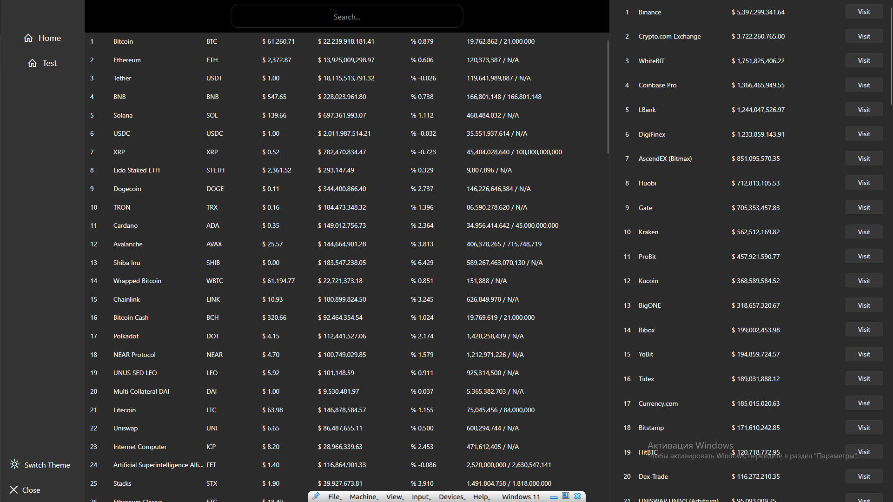

# Digital Cloud Technologies

# Панель криптовалют

## Огляд проєкту

Це додаток WPF, що відображає різну інформацію, пов’язану з криптовалютами, детальні дані про окремі валюти та можливість пошуку валют. Проєкт реалізований з використанням C# та платформи .NET з акцентом на паттерні MVVM.

## Функціонал

### Основний функціонал
- **Топ бірж для купівлі:** Відображення бірж які отримує API.
- **Головна сторінка валют:** Перегляд інформації про кожну валюту, включаючи:
  - Ранг
  - Назву
  - Символ криптовалюти
  - Ціна криптовалюти
  - Обсяг обігу за останні 24 години
  - Зміна в % за останні 24 години
  - представлення (В обігу / Загальна кількість)
  - Доступні ринки (із можливістю перейти на біржу).
- **Пошук:** Можливість пошуку валюти за назвою, кодом або рангом.
- **Навігація:** Підтримка навігації.

### Додатковий функціонал
- **Лінійні графіки криптовалют за останній рік(Обмеження API):** Відображення лінійних графіків для вибраних валют.
- **Світла/темна тема:** Перемикання між світлою і темною темою.

## Використані технології

- **C#** – мова програмування.
- **.NET (WPF)** – платформа для створення користувацького інтерфейсу.
- **Паттерн MVVM** – реалізований для розділення логіки, даних та представлення.
- **HttpClient** – використовується для виконання запитів до API.
- **Newtonsoft.Json** – для обробки JSON відповідей від API.
- **LiveCharts** – використовується для відображення графіків.
- **ModernWpfUI** – використовується для загального дизайну.

## Використані API

Проєкт взаємодіє з даними про криптовалюти через API:

- [CoinCap API](https://docs.coincap.io/)

## Майбутні покращення
- **Графіки котирувань криптовалют:** Відображення свічкових графіків для вибраних валют.
- **Конвертер валют:** Конвертація однієї криптовалюти в іншу.
- **Підтримка локалізацій:** Підтримка кількох мов (англійська, українська тощо).
- **Оптимізація продуктивності:** Покращення швидкості завантаження даних і реакцій інтерфейсу.

## Скріншоти

*Головна сторінка, світла тема.*

*Детальна інформація про вибрану криптовалюту у світлій темі.*

*Головна сторінка, темна тема.*

*Детальна інформація про вибрану криптовалюту у темній темі.*

